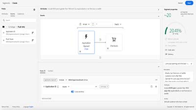
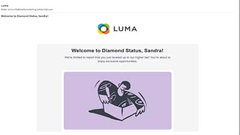

# Journey Optimizer Challenges - Introduction

Challenges provide a scenario and the requirements needed to practice what you learn. Use these Challenges to evaluate your skill level and identify areas for improvement.

## The Story

Luma, a fictional athletic apparel company, is looking to promote its latest apparel and gear collection and to drive sales for existing customers. Luma uses Adobe Journey Optimizer to deliver connected, contextual, and personalized experiences to their customers.

You have been hired to implement the Luma marketing and retention campaigns in Journey optimizer.

You are faced with three challenges:
<table>
<tr>
<td>
  

      
      

  </td>
  <td>
   <a href="./create-segments-challenge.md">
    <strong>Challenge 1: 
 Create segments </strong>
    </a>
      

      <em>To target specific customer segments and make sure that the customers receive the personalized product information, you need to the create segments that are used in the customer journeys.</em>
      

    </td>
  </tr>
  <tr>
  <td>
  

    
  </td>
  <td>
      <a href="./create-segments-challenge.md">
    <strong>Challenge 2:
Create and personalize email messages </strong>
    </a>
    

    

    <em>Create the personalized email messages that Luma customers receive when they interact with the brand or fall into the segment that is targeted with the Luma marketing campaign.
    </em>
    

  </td>
  </tr>
  <tr>
    <td>
    

    
    

    <td>
    

      <a href="./create-journeys-challenge.md">
    <strong>Challenge 3:
Create Journeys </strong>
    </a>
    

    

    <em>Implement Luma's customer journeys for the following use cases:
      <li>
      Promote the new Luma summer collection
      </li> 
      <li>
      Send an order confirmation email when someone completes an online purchase
      </li> 
      <li> 
      Send an email when a loyalty customer moves to a new tier to congratulate and inform them of their new benefits
      </li> 
      <li>
      Notify customers, when a previously out-of-stock item is back in stock
      </li>
      </em>
    

  </td>
</table>

## Do you have everything you need?

### System requirements

* Access to a Journey Optimizer Journey instance
  * Make sure you have either *Journey Manager* or *Journey Administrator* rights
* AEM Assets Essentials must be provisioned for your instance
* It is recommended to complete the challenge in a dedicated training sandbox. Refer to the [Set-up a training sandbox tutorial](/help/tutorial-set-up-training-sandbox/overview.md) for instructions.

### Skills you might need

To develop the knowledge and skills needed for this challenge, complete the following course:

* Course [Getting started with Journey Optimizer for Journey Managers and Administrators](https://experienceleague.adobe.com/?recommended=JourneyOptimizer-U-1-2021.1)
  
### Required actions

1. [Create a test profile](https://experienceleague.adobe.com/docs/journey-optimizer-learn/tutorials/create-journeys/test-a-journey.html?lang=en)
   1. From the Journey Optimizer Home Page, find the Create Test Profiles use case and complete it to create a test profile for yourself.
   2. Use *Email* as the identity namespace (use your email address for both the Person ID and Email Address fields)
   3. Optionally you can add a street address (column header: *street1*) to your test profile.
2. [Download all Luma assets](/help/challenges/assets/email-assets/luma-assets.zip).
